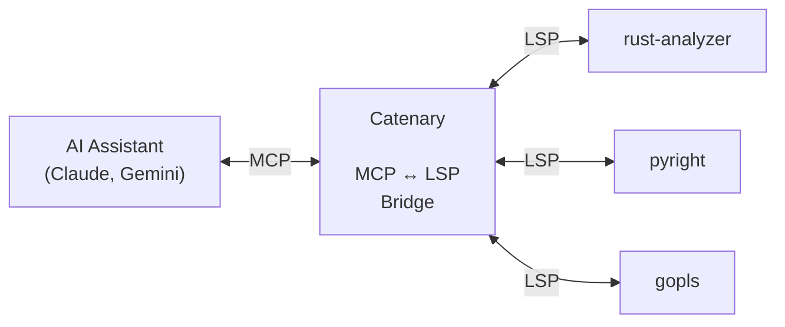

# Catenary

[](https://github.com/MarkWells-Dev/Catenary/actions/workflows/ci.yml)
[](https://github.com/MarkWells-Dev/Catenary/actions/workflows/cd.yml)

**Stop wasting context on redundant file reads.**

AI coding agents are smart. The bottleneck isn't intelligence — it's I/O.
Every file an agent reads goes into an append-only context window. Every edit
creates another copy. Three rounds of read-edit-verify on a single file puts
three full copies in context, re-processed on every subsequent turn. In a
typical session, this produces a **1,000x+ amplification** between what you
type and what the model actually processes.

Catenary replaces brute-force file scanning with **graph navigation**. Instead
of reading a 500-line file to find a type signature, the agent asks the
language server directly — 50 tokens instead of 2,000. Instead of grepping
across 20 files to find a definition, one LSP query returns the exact
location. The context stays lean across the entire session.

## How It Works



Catenary bridges [MCP](https://modelcontextprotocol.io/) and
[LSP](https://microsoft.github.io/language-server-protocol/), giving agents
the same code intelligence that powers your IDE. It manages multiple language
servers, routes requests by file type, and provides automatic post-edit
diagnostics — all through a single MCP server.

## Quick Start

### 1. Install

```bash
cargo install catenary-mcp
```

### 2. Configure language servers

Add your language servers to `~/.config/catenary/config.toml`:

```toml
[server.rust]
command = "rust-analyzer"

[server.python]
command = "pyright-langserver"
args = ["--stdio"]
```

### 3. Connect your AI assistant

**Claude Code**
```
/plugin marketplace add https://github.com/MarkWells-Dev/Catenary
/plugin install catenary@catenary
```

The plugin configures the MCP server and adds a `PostToolUse` hook that
returns LSP diagnostics after every edit.

**Gemini CLI**
```bash
gemini extensions install https://github.com/MarkWells-Dev/Catenary
```

The extension configures the MCP server and adds an `AfterTool` hook that
returns LSP diagnostics after every edit.

Optionally, install the [policy file](https://markwells-dev.github.io/catenary/cli-integration.html#gemini-cli)
to `~/.gemini/policies/catenary-constrained.toml` to block text-scanning
commands and force LSP-first navigation.

> Catenary also works as a supplement alongside built-in tools — just add the
> MCP server without restricting permissions. But you'll get the most value in
> **[constrained mode](https://markwells-dev.github.io/catenary/cli-integration.html)**,
> where the agent is forced to use efficient LSP queries instead of falling
> back to file reads and grep.

### 4. Verify

Check that your language servers are working:

```bash
catenary doctor
```

```
rust         rust-analyzer       ✓ ready
             hover definition references document_symbols search code_actions rename call_hierarchy

python       pyright-langserver  ✓ ready
             hover definition references document_symbols search rename

toml         taplo               - skipped (no matching files)
```

Then edit any source file — you should see LSP diagnostics appear in the
model's context after each edit. Catenary's `PostToolUse` hook automatically
notifies the running LSP servers and returns any errors or warnings.

## Why This Matters

| Operation | Tokens | Copies in context |
|-----------|--------|-------------------|
| Read a 500-line file | ~2,000 | +1 per read |
| Rewrite that file | ~2,000 | +1 (now 2 copies) |
| Read it again to verify | ~2,000 | +1 (now 3 copies) |
| **Total for one file** | **~6,000** | **3 copies** |

| LSP alternative | Tokens | Copies in context |
|-----------------|--------|-------------------|
| `hover` for type info | ~100 | 0 (stateless) |
| `definition` | ~50 | 0 |
| Native edit + notify hook diagnostics | ~300 | 0 (no re-read needed) |
| **Total** | **~450** | **0 copies** |

Every token in context is re-processed on every turn. Bigger context windows
don't fix this — they just let you waste more before hitting the wall.

## Tools

| Tool | Description |
|------|-------------|
| `hover` | Documentation and type info |
| `definition` | Go to definition |
| `find_references` | Find all references |
| `search` | Symbol search with grep fallback |
| `diagnostics` | Errors and warnings |
| `list_directory` | List directory contents |
| `catenary notify` | PostToolUse hook — returns LSP diagnostics after edits |
| ... | [See all tools](https://github.com/MarkWells-Dev/Catenary/wiki/Overview#available-tools) |

## Known Limitations

**MCP tool display in CLIs.** Claude Code and Gemini CLI render built-in tools
with clean, purpose-built UI — diffs for edits, syntax highlighting for reads.
MCP tools get none of this. Catenary's LSP tool calls show raw escaped JSON in
the approval prompt. This is a host CLI limitation, not something Catenary can
fix — MCP tools need the same display treatment as built-in tools.

File I/O uses the host's native tools (with full diff/highlight UX) and
Catenary provides diagnostics via the `PostToolUse` hook.

## Documentation

Full documentation at **[markwells-dev.github.io/catenary](https://markwells-dev.github.io/catenary/)**

- **[Overview](https://markwells-dev.github.io/catenary/overview.html)** — The problem, the solution, available tools
- **[Installation](https://markwells-dev.github.io/catenary/installation.html)** — Setup for Claude Code, Claude Desktop, Gemini CLI
- **[Configuration](https://markwells-dev.github.io/catenary/configuration.html)** — Language servers, `catenary doctor`
- **[CLI Integration](https://markwells-dev.github.io/catenary/cli-integration.html)** — Constrained mode for Claude Code and Gemini CLI
- **[AI Agents](https://markwells-dev.github.io/catenary/ai-agents.html)** — System prompt suggestions and workflow patterns

## License

**GPL-3.0** — See [LICENSE](LICENSE) for details.

**Commercial licensing** available for proprietary use. Contact `contact@markwells.dev`.
