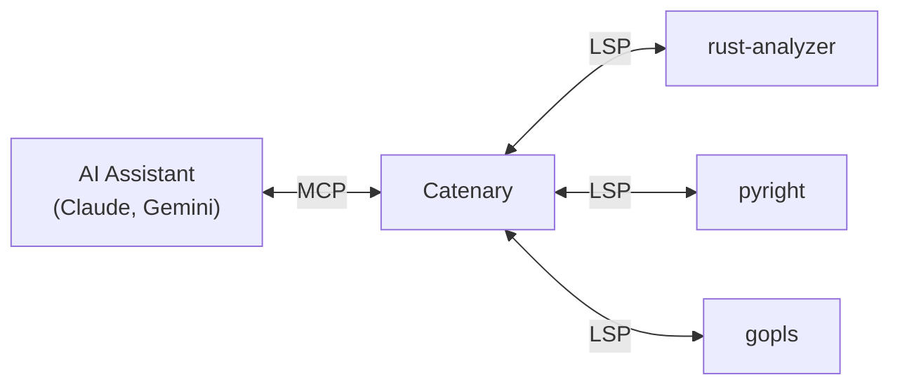

# Catenary

[](https://github.com/MarkWells-Dev/Catenary/actions/workflows/ci.yml)
[](https://github.com/MarkWells-Dev/Catenary/actions/workflows/cd.yml)

**Stop wasting context on redundant file reads.**

AI coding agents are smart. The bottleneck isn't intelligence — it's I/O.
Every file an agent reads goes into an append-only context window. Every edit
creates another copy. Three rounds of read-edit-verify on a single file puts
three full copies in context, re-processed on every subsequent turn. In a
typical session, this produces a **1,000x+ amplification** between what you
type and what the model actually processes.

Catenary replaces brute-force file scanning with **graph navigation**. Instead
of reading a 500-line file to find a type signature, the agent asks the
language server directly — 50 tokens instead of 2,000. Instead of grepping
across 20 files to find a definition, one LSP query returns the exact
location. The context stays lean across the entire session.

## How It Works



Catenary bridges [MCP](https://modelcontextprotocol.io/) and
[LSP](https://microsoft.github.io/language-server-protocol/), giving agents
the same code intelligence that powers your IDE. It manages multiple language
servers, routes requests by file type, and provides file I/O with automatic
diagnostics — all through a single MCP server.

## Quick Start

### 1. Install

```bash
cargo install catenary-mcp
```

### 2. Configure language servers

Add your language servers to `~/.config/catenary/config.toml`:

```toml
[server.rust]
command = "rust-analyzer"

[server.python]
command = "pyright-langserver"
args = ["--stdio"]
```

### 3. Connect your AI assistant

**Claude Code** (recommended — constrained mode)
```bash
claude mcp add catenary -- catenary
```

Then add to `.claude/settings.json` to replace built-in tools with Catenary:

```json
{
  "permissions": {
    "deny": ["Read", "Edit", "Write", "Bash", "Grep", "Glob", "Task", "NotebookEdit"],
    "allow": ["WebSearch", "WebFetch", "mcp__catenary__*", "ToolSearch", "AskUserQuestion"]
  }
}
```

**Gemini CLI** (recommended — constrained mode)
```json
{
  "tools": {
    "core": ["web_fetch", "google_web_search", "save_memory"]
  },
  "mcpServers": {
    "catenary": { "command": "catenary" }
  }
}
```

> Catenary also works as a supplement alongside built-in tools — just add the
> MCP server without restricting permissions. But you'll get the most value in
> constrained mode, where the agent is forced to use efficient LSP queries
> instead of falling back to file reads and grep.

### 4. Display hooks (optional)

Catenary's `edit_file` and `write_file` tools pass raw JSON to the CLI, which
is hard to review. The bundled hook formats these as colorized diffs and
previews.

**Claude Code**
```bash
mkdir -p ~/.claude/hooks
cp .claude-plugin/plugins/catenary/hooks/format_tool_output.py ~/.claude/hooks/
chmod +x ~/.claude/hooks/format_tool_output.py
```

Add to `~/.claude/settings.json`:
```json
{
  "hooks": {
    "PreToolUse": [
      {
        "matcher": "mcp__.*__edit_file|mcp__.*__write_file",
        "hooks": [{ "type": "command", "command": "~/.claude/hooks/format_tool_output.py" }]
      }
    ]
  }
}
```

**Gemini CLI** — not currently supported. Gemini's `BeforeTool` hook fires
after the user approves the tool call, so there's no way to show a formatted
diff in the approval prompt. The raw JSON parameters are all that's available
at decision time.

## Why This Matters

| Operation | Tokens | Copies in context |
|-----------|--------|-------------------|
| Read a 500-line file | ~2,000 | +1 per read |
| Rewrite that file | ~2,000 | +1 (now 2 copies) |
| Read it again to verify | ~2,000 | +1 (now 3 copies) |
| **Total for one file** | **~6,000** | **3 copies** |

| LSP alternative | Tokens | Copies in context |
|-----------------|--------|-------------------|
| `hover` for type info | ~100 | 0 (stateless) |
| `definition` | ~50 | 0 |
| `edit_file` (returns diagnostics) | ~300 | 0 (no re-read needed) |
| **Total** | **~450** | **0 copies** |

Every token in context is re-processed on every turn. Bigger context windows
don't fix this — they just let you waste more before hitting the wall.

## Tools

| Tool | Description |
|------|-------------|
| `hover` | Documentation and type info |
| `definition` | Go to definition |
| `find_references` | Find all references |
| `search` | Symbol search with grep fallback |
| `diagnostics` | Errors and warnings |
| `read_file` | Read file contents + diagnostics |
| `write_file` | Write file + diagnostics |
| `edit_file` | Search-and-replace edit + diagnostics |
| `list_directory` | List directory contents |
| `run` | Execute shell commands (allowlist enforced) |
| ... | [See all tools](https://github.com/MarkWells-Dev/Catenary/wiki/Overview#available-tools) |

## Known Limitations

**MCP tool display in CLIs.** Claude Code and Gemini CLI render built-in tools
with clean, purpose-built UI — diffs for edits, syntax highlighting for reads.
MCP tools get none of this. Every Catenary tool call shows raw escaped JSON in
the approval prompt, making the normally sleek UX feel like a debug console.

The bundled display hook (step 4 above) patches this for `edit_file` and
`write_file` in Claude Code, but every other tool still renders as JSON. This
is a host CLI limitation, not something Catenary can fix — MCP tools need the
same display treatment as built-in tools.

**Gemini CLI hooks fire post-approval.** Gemini's `BeforeTool` hook runs after
the user accepts the tool call, so display hooks can't improve the approval
prompt. The formatted output only appears in the debug console.

## Documentation

- **[Overview](https://github.com/MarkWells-Dev/Catenary/wiki/Overview)** — The problem, the solution, available tools
- **[Install](https://github.com/MarkWells-Dev/Catenary/wiki/Install)** — Setup for Claude Code, Claude Desktop, Gemini CLI
- **[Config](https://github.com/MarkWells-Dev/Catenary/wiki/Config)** — Configuration reference
- **[LSPs](https://github.com/MarkWells-Dev/Catenary/wiki/LSPs)** — Language server setup guides
- **[AI Agents](https://github.com/MarkWells-Dev/Catenary/wiki/AI-Agents)** — System prompt suggestions and workflow patterns

## License

**GPL-3.0** — See [LICENSE](LICENSE) for details.

**Commercial licensing** available for proprietary use. Contact `contact@markwells.dev`.
